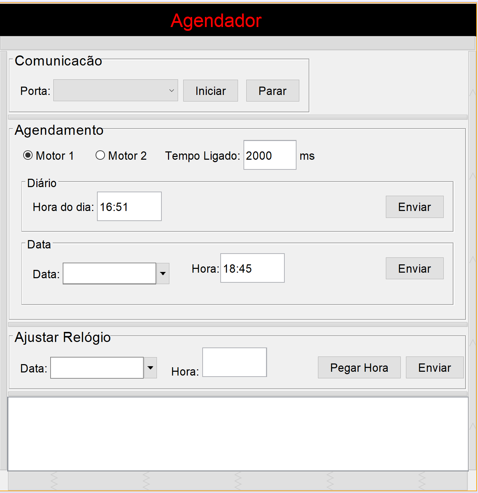

# Scheduler

Embedded software that works along with [agendador](https://github.com/aleaugustoplus/agendador) which is a system that controls electric motors in order to execute and automate tasks both software comunicate via serial port

## Getting Started

Simply download it to your arduino board

### Prerequisites

Arduino board serial comunication and motor driver board
Requires rxtxSerial 
Requires [agendador](https://github.com/aleaugustoplus/agendador) to be programmed

## Programming interface Screenshots

### Installing

Use arduino IDE to download the software to the arduino board tested with ARDUINO UNO

## Running the tests

Automated tests have not been used 

## Built With

* [Arduino](https://www.arduino.cc/)

## Contributing

Please stay free to submit pull requests at any time

## Authors

* **Alexandre Lopes** - *Initial work* - [Alexandre Lopes](http://alexandre-lopes.com)

## License

This project is licensed under the MIT License - see the [LICENSE](https://en.wikipedia.org/wiki/MIT_License) page for details

## Acknowledgments

* Some third party open source libraries have been used thank you for that

https://aprendizadodemaquina.com
